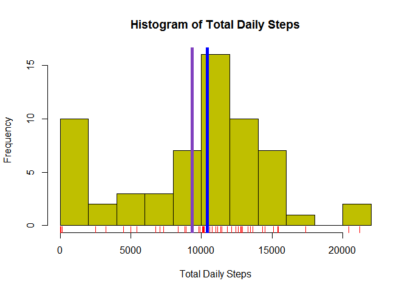
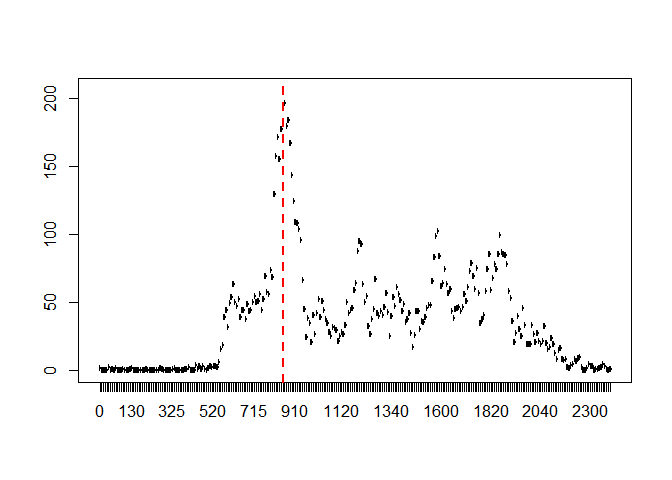
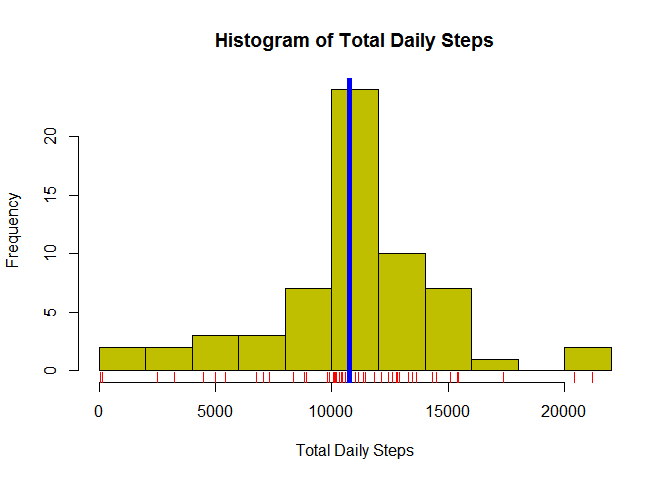
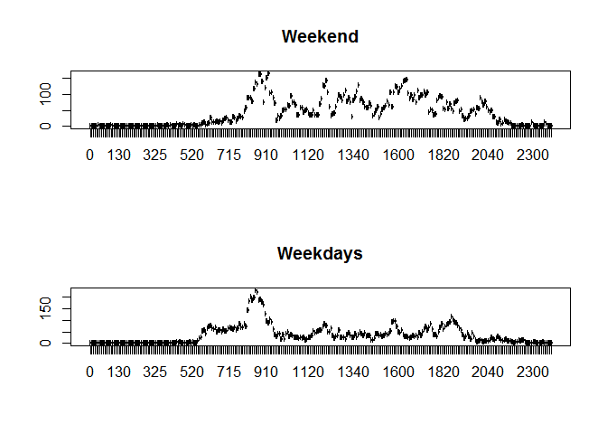

# Reproducible Research: Peer Assessment 1


## Overview

This document addresses several questions with respect to data from a personal activity monitoring device. The underlying r codes require loading the "lubridate" and "dplyr" packages.

## Loading and preprocessing the data
We first load the data using the read.csv function and coerce the date and interval columns into the correct formats:


```r
raw <- read.csv("./activity.csv",header = T)
raw$date <- ymd(raw$date)
raw$interval <- as.factor(raw$interval)
head(raw)
```

```
##   steps       date interval
## 1    NA 2012-10-01        0
## 2    NA 2012-10-01        5
## 3    NA 2012-10-01       10
## 4    NA 2012-10-01       15
## 5    NA 2012-10-01       20
## 6    NA 2012-10-01       25
```

## What is mean total number of steps taken per day?
The mean and median of the daily number of steps are plotted using purple and blue vertical lines on the histogram:

```r
daily <- raw %>%
        group_by(date) %>%
        summarise(total.steps = sum(steps,na.rm = T))
mean(daily$total.steps)
```

```
## [1] 9354.23
```

```r
median(daily$total.steps)
```

```
## [1] 10395
```

```r
hist(x = daily$total.steps,breaks = 10, main = "Histogram of Total Daily Steps", xlab = "Total Daily Steps", col = rgb(.75,.75,0))
rug(x = daily$total.steps, col = "red")
abline(v = mean(daily$total.steps), col = rgb(0.5,0.25,0.75), lwd = 5)
abline(v = median(daily$total.steps), col = "blue", lwd = 5)
```



## What is the average daily activity pattern?
A time series plot of daily number of steps is shown below:

```r
time.series <- raw %>%
        group_by(interval) %>%
        summarise(avg.steps = mean(steps,na.rm = T))
plot(x = time.series$interval, y = time.series$avg.steps, xlib = "Interval", ylib = "Average Steps", type = "l", lty = 1, lwd = 2)
time.series$interval[which.max(time.series$avg.steps)]
```

```
## [1] 835
## 288 Levels: 0 5 10 15 20 25 30 35 40 45 50 55 100 105 110 115 120 ... 2355
```

```r
abline(v = time.series$interval[which.max(time.series$avg.steps)], col = "red", lwd = 2, lty = 2)
```



As we can see, the activity peeks during the 835 interval (around 2pm!).

## Imputing missing values
So far, we have been removing the missing values from the analysis. In total, there are 2304 rows with missing values in the data set:

```r
nrow(raw) - sum(complete.cases(raw))
```

```
## [1] 2304
```

It makes reasonable sense to replace each missing value by the average number of steps across different dates for the same interval.


```r
imputed <- merge(raw,time.series, by="interval")
imputed <- imputed %>%
        mutate(temp = as.integer(is.na(steps))*avg.steps)
        
imputed[is.na(imputed$steps),"steps"] <- 0

imputed <- imputed %>%
        mutate(steps.imputed = steps + temp) %>%
        select(interval,date,steps.imputed)
head(imputed)
```

```
##   interval       date steps.imputed
## 1        0 2012-10-01      1.716981
## 2        0 2012-11-23      0.000000
## 3        0 2012-10-28      0.000000
## 4        0 2012-11-06      0.000000
## 5        0 2012-11-24      0.000000
## 6        0 2012-11-15      0.000000
```

The new dataset contains no missing values:

```r
nrow(imputed) - sum(complete.cases(imputed))
```

```
## [1] 0
```

Let's revisit the histogram for the total number of steps each day using the new imputed data set:

```r
daily <- imputed %>%
        group_by(date) %>%
        summarise(total.steps = sum(steps.imputed))
mean(daily$total.steps)
```

```
## [1] 10766.19
```

```r
median(daily$total.steps)
```

```
## [1] 10766.19
```

It is interesting to see that mean and median of the total number of daily steps is the same for the new dataset, which means that there is no right- or left-skwedness in the imputed data. Here is the new histogram:


```r
hist(x = daily$total.steps,breaks = 10, main = "Histogram of Total Daily Steps", xlab = "Total Daily Steps", col = rgb(.75,.75,0))
rug(x = daily$total.steps, col = "red")
abline(v = mean(daily$total.steps), col = rgb(0.5,0.25,0.75), lwd = 5)
abline(v = median(daily$total.steps), col = "blue", lwd = 5)
```



## Are there differences in activity patterns between weekdays and weekends?
To address this question, we first use the weekdays() function to create a factor called "wd" that indicates whether a day is weekend or a weekday:

```r
imputed <- imputed %>%
        mutate(wd = weekdays(date))

imputed[which(imputed$wd == "Saturday" | imputed$wd == "Sunday"),"wd"] <- "weekend"
imputed[which(imputed$wd != "weekend"),"wd"] <- "weekday"  
```

We then summarize the data into two time series for weekends and weekdays:

```r
time.series1 <- imputed %>%
        filter(wd == "weekend") %>%
        group_by(interval) %>%
        summarise(avg.steps = mean(steps.imputed,na.rm = T))
time.series2 <- imputed %>%
        filter(wd == "weekday") %>%
        group_by(interval) %>%
        summarise(avg.steps = mean(steps.imputed,na.rm = T))
par(mfrow = c(2,1))
plot(x = time.series1$interval, y = time.series1$avg.steps, xlib = "Interval", ylib = "Average Steps", type = "l", main = "Weekend", col = "blue", lty = 1, lwd = 2)
plot(x = time.series2$interval, y = time.series2$avg.steps, xlib = "Interval", ylib = "Average Steps", type = "l", main = "Weekdays", col = "blue", lty = 1, lwd = 2)
```



As we can see, the weekend pattern is quite different than that of weekdays. The activity level is generally higher during weekends with several high-magnitude peeks. It does seem like the subject has a desk job!
